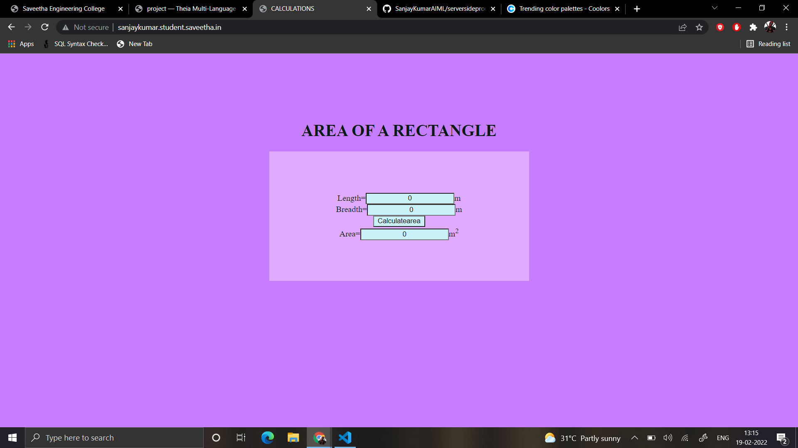

# Design a Website for Server Side Processing

## AIM:
To design a website to perform mathematical calculations in server side.

## DESIGN STEPS:

### Step 1:
Requirement collection.

### Step 2:
Creating the layout using HTML and CSS.

### Step 3:
Write the calculations part in views.py .

### Step 4:
Set the path in urls.py .

### Step 5:
Run the Server.

### Step 6:
Publish the website in the given URL.

## PROGRAM :
### area.html:
```
<!DOCTYPE html>
<html>
<head>
    <meta charset='utf-8'>
    <meta http-equiv='X-UA-Compatible' content='IE=edge'>
    <title>CALCULATIONS</title>
    <meta name='viewport' content='width=device-width, initial-scale=1'>
    <link rel='stylesheet' type='text/css' media='screen' href='main.css'>
</head>
<body style="text-align: center;background-color: #c77dff;color: #081c15; padding-top: 100px;" >
    <h1>AREA OF A RECTANGLE</h1>
    <div style="display: block; background-color: #e0aaff;text-align: center; width: 500px; height: 170px; margin-left: auto; margin-right: auto; padding-top: 80px;">
        <form method="POST">
            
            Length=<input type='text' name='length' value='{{l}}' style="text-align: center; text-align: center; background-color: #caf0f8;" >m</input><br/>
            Breadth=<input type='text' name='breadth' value='{{b}}' style="text-align: center; text-align: center; background-color: #caf0f8;">m</input><br/>
            <input type='submit' value='Calculatearea' style="text-align: center; width: 100px; text-align: center; background-color: #caf0f8;"></input><br/>
            Area=<input type='text' name='area' value='{{area}}' style="text-align: center; text-align: center; background-color: #caf0f8;">m<sup>2</sup></input><br/>
        </form>
    </div>
</body>
</html>
```
### views.py:
```
from django.shortcuts import render

# Create your views here.
def areacalcution(request):
    context={}
    context['area']='0'
    context['l']='0'
    context['b']='0'
    if request.method == 'POST':
        l=request.POST.get('length','0')
        b=request.POST.get('breadth','0')
        area=int(l)*int(b)
        context['area']=area
        context['l']=l
        context['b']=b
    return render(request,'mathapp/area.html',context)

```
### urls.py:
```
"""calculations URL Configuration

The `urlpatterns` list routes URLs to views. For more information please see:
    https://docs.djangoproject.com/en/3.1/topics/http/urls/
Examples:
Function views
    1. Add an import:  from my_app import views
    2. Add a URL to urlpatterns:  path('', views.home, name='home')
Class-based views
    1. Add an import:  from other_app.views import Home
    2. Add a URL to urlpatterns:  path('', Home.as_view(), name='home')
Including another URLconf
    1. Import the include() function: from django.urls import include, path
    2. Add a URL to urlpatterns:  path('blog/', include('blog.urls'))
"""
from django.contrib import admin
from django.urls import path
from mathapp import views

urlpatterns = [
    path('admin/', admin.site.urls),
    path('areaofrectangle/',views.areacalcution,name='areaofrectangle'),
    path('',views.areacalcution,name='areaofrectangleroot')
]

```


## Output:


## Output with input:


## Result:
A website to perform mathematical calculations in server side is designed.